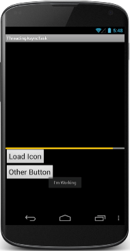

##AsyncTask
Класс AsyncTask обеспечивает структурированный способ управлять потоками, которорые работают в фоне и UI-потоками.

**Background thread (фоновый поток)** 
- выполняет тяжелые операции 
- может сообщать прогресс операции.

**UI-thread**
- публикует промежуточные результаты
- получает результат, после того как фоновый поток сделал свою работу

**AsyncTask** - это обобщенный (generic) класс, который принимает 3 параметра конструктора:
- *params (параметры)* - тип входных параметров.
- *progress (прогресс)* - тип прогресса.
- *result (результат)* - тип возвращаемого результата. 
```java
private class MyTask extends AsyncTask<Void, Void, Void> { ... }
```

**Работа класса AsyncTask**

1. Вызывается метод ```void onPreExecude()``` - выполняется в потоке UI-thread перед методом ```doInBackground()``` Устанавливаются различные параметры для работы в отдельном потоке.

2. Вызывается метод ```doInBackground(Params... params)``` - выполняет свои операции в фоновом потоке. Принимает переменную *params* - список входных параметров, возвращает результат типа *result*. Так же метод может при необходимости вызвать метод ```void publishProgress(Progress... values)``` передавая ему список переменных значений, который дает некоторое представление о ходе выполнения длительной операции. Метод ```onProgressUpdate(Progress... values)``` отвечает на вызов метода ```void publishProgress(Progress... values)``` в потоке UI-thread пока фоновый поток все еще работает.

3. Вызывается метод ```void onPostExecude(Result result)``` - выполняется в потоке пользовательского интерфейса (UI-thread) после завершения метода ```doInBackground(Params... params)```. Возвращает *result*.

**Пример приложения**



```java
public class AsyncTaskActivity extends Activity {
	private final static String TAG = "ThreadingAsyncTask";
	
	private ImageView mImageView;
	private ProgressBar mProgressBar;
	private int mDelay = 500;
	
	@Override
	public void onCreate(Bundle savedInstanceState) {
		super.onCreate(savedInstanceState);
		setContentView(R.layout.main);

		mImageView = (ImageView) findViewById(R.id.imageView);;
		mProgressBar = (ProgressBar) findViewById(R.id.progressBar);
		
		final Button button = (Button) findViewById(R.id.loadButton);
		button.setOnClickListener(new OnClickListener() {
			public void onClick(View v) {
				new LoadIconTask().execute(R.drawable.painter);
			}
		});
		
		final Button otherButton = (Button) findViewById(R.id.otherButton);
		otherButton.setOnClickListener(new OnClickListener() {
			@Override
			public void onClick(View v) {
				Toast.makeText(AsyncTaskActivity.this, "I'm Working",
						Toast.LENGTH_SHORT).show();
			}
		});

	}

	class LoadIconTask extends AsyncTask<Integer, Integer, Bitmap> {

		@Override
		protected void onPreExecute() {
			mProgressBar.setVisibility(ProgressBar.VISIBLE);
		}

		@Override
		protected Bitmap doInBackground(Integer... resId) {
			Bitmap tmp = BitmapFactory.decodeResource(getResources(), resId[0]);
			// simulating long-running operation 
			for (int i = 1; i < 11; i++) {
				sleep();
				publishProgress(i * 10);
			}
			return tmp;
		}

		@Override
		protected void onProgressUpdate(Integer... values) {
			mProgressBar.setProgress(values[0]);
		}

		@Override
		protected void onPostExecute(Bitmap result) {
			mProgressBar.setVisibility(ProgressBar.INVISIBLE);
			mImageView.setImageBitmap(result);
		}

		private void sleep() {
			try {
				Thread.sleep(mDelay);
			} catch (InterruptedException e) {
				Log.e(TAG, e.toString());
			}
		}
	}
}
```


#НЕ ОТСОРТИРОВАННО

# AsyncTask - знакомство. Ex 27
Некоторые методы базового класса AsyncTask:
- onPreExecute(); - этот метод вызывается в потоке пользовательского интерфейса прежде чем задача будет выполнена, т.е. перед тем как наша задача будет начинать свое выполнение мы зайдем в данный метод.
- onPostExecute(); - выполняется после окончания нашей задачи, т.е. после того как задача завершила свое выполнение - выполнится данный метод.
- doInBackground(); - в этом методе выполняются все наши текущие задачи в фоновом режиме.
- onProgressUpdate(); - этот метод вызывается в потоке пользовательского интерфейса после вызова метода publishProgress() и этот метод используется для отображения любых форм процессов в пользовательском интерфейсе.

Пример activity (1 progressBar, TextView - процетны, Button - запуск)
public class MainActivity extends Activity {

    private ProgressBar progressBar;
    private TextView txtStates;

    @Override
    protected void onCreate(Bundle savedInstanceState) {
        super.onCreate(savedInstanceState);
        setContentView(R.layout.main_layout);

        progressBar = (ProgressBar) findViewById(R.id.progressBar);
        txtStates = (TextView) findViewById(R.id.txtState);
    }

    public void onProgressButton(View view) {
        new MyProgressBarAsyncTask().execute();
    }

    class MyProgressBarAsyncTask extends AsyncTask<Void, Integer, Void> {

        private int progressBarValue = 0;

        @Override
        protected void onPreExecute() {
            super.onPreExecute();
            Toast.makeText(MainActivity.this, "Начало процесса", Toast.LENGTH_SHORT).show();
        }

        @Override
        protected void onPostExecute(Void aVoid) {
            super.onPostExecute(aVoid);
            Toast.makeText(MainActivity.this, "Процесс окончен", Toast.LENGTH_SHORT).show();
        }

        @Override
        protected void onProgressUpdate(Integer... values) {
            super.onProgressUpdate(values);
            progressBar.setProgress(values[0]);
            txtStates.setText(values[0] + " %");
        }

        @Override
        protected Void doInBackground(Void... params) {
            while (progressBarValue < 100) {
                progressBarValue++;
                publishProgress(progressBarValue);
                SystemClock.sleep(200);
            }

            return null;
        }
    }
}

# AsyncTask - получаем результат. Ex 28
При наследовании от базового класса AsyncTask - необходимо указывать 3 generic значения:
1) Params extends Object - тип входящих данных.
2) Progrсess extends Object - тип промежуточных данных - это те данные, которые потребуются для нашего AsyncTask что бы сделать определенные вычисления.
3) Result extends Object - тип возврощаемых данных.